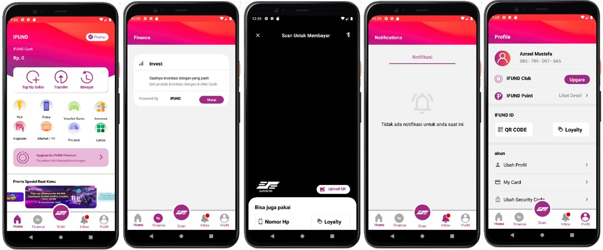

## *Implementasi Tools RAD android studio*
## IFUND App



Berikut ini adalah cara mengimplementasi app yang telah dirancang kedalam mobole apps, kami menggunakan tools RAD
android studio untuk coding dan untuk bahasa pemrograman yang kami gunakan adalah kotlin. design kami adaptasi dari
tools figma.

adapun langkah langkahnya sebagai berikut

1. Menambahkan refrensi dependencies pada module gradle app

```bash
    //viewPageII
    implementation 'androidx.viewpager2:viewpager2:1.0.0'
    //RoundedImageView
    implementation 'com.makeramen:roundedimageview:2.3.0'
```

**isi class SliderItem.kt**

```bash
package com.example.project_mdpl

class SliderItem internal constructor(
    val image: Int
)
```

**isi class SliderAdapter.kt**

```bash
package com.example.project_mdpl

import android.view.LayoutInflater
import android.view.View
import android.view.ViewGroup
import androidx.recyclerview.widget.RecyclerView
import androidx.viewpager2.widget.ViewPager2
import com.makeramen.roundedimageview.RoundedImageView

class SliderAdapter internal constructor(
    sliderItems: MutableList<SliderItem>,
    viewPager: ViewPager2
): RecyclerView.Adapter<SliderAdapter.SliderViewHolder>(){

    private val sliderItems: List<SliderItem>
    init {
        this.sliderItems = sliderItems
    }

    class SliderViewHolder(itemView: View) : RecyclerView.ViewHolder(itemView){
        private val imageView: RoundedImageView = itemView.findViewById(R.id.imageSlide)

        fun image(sliderItem: SliderItem){
            imageView.setImageResource(sliderItem.image)
        }
    }

    override fun onCreateViewHolder(parent: ViewGroup, viewType: Int): SliderViewHolder {
        return SliderViewHolder(
            LayoutInflater.from(parent.context).inflate(
                R.layout.slide_item_container,
                parent,
                false
            )
        )
    }

    override fun onBindViewHolder(holder: SliderViewHolder, position: Int) {
        holder.image(sliderItems[position])
    }

    override fun getItemCount(): Int {
        return sliderItems.size
    }
}
```

3. pada mainactivity isikan code seperti dibawah ini, di file ini digunakan untuk pengaturan image slide dan importnya
selanjutnya juga digunakan untuk perpindahan laman / Intent 

**code file MainActivity.kt**

```bash
package com.example.project_mdpl

import android.content.Intent
import androidx.appcompat.app.AppCompatActivity
import android.os.Bundle
import android.view.Window
import android.view.WindowManager
import android.widget.TextView
import androidx.core.content.ContextCompat
import androidx.recyclerview.widget.RecyclerView
import androidx.viewpager2.widget.CompositePageTransformer
import androidx.viewpager2.widget.MarginPageTransformer
import androidx.viewpager2.widget.ViewPager2

class MainActivity : AppCompatActivity() {

    private lateinit var viewPager2: ViewPager2

    override fun onCreate(savedInstanceState: Bundle?) {
        super.onCreate(savedInstanceState)
        setContentView(R.layout.activity_main)

        viewPager2 = findViewById(R.id.viewPager_ImageSlider)
        val sliderItems: MutableList<SliderItem> = ArrayList()
        sliderItems.add(SliderItem(R.drawable.slide1))
        sliderItems.add(SliderItem(R.drawable.slide2))
        sliderItems.add(SliderItem(R.drawable.slide3))

        viewPager2.adapter = SliderAdapter(sliderItems, viewPager2)

        viewPager2.clipToPadding = false
        viewPager2.clipChildren = false
        viewPager2.offscreenPageLimit = 2
        viewPager2.getChildAt(0).overScrollMode = RecyclerView.OVER_SCROLL_NEVER

        val compositePageTransformer = CompositePageTransformer()
        compositePageTransformer.addTransformer(MarginPageTransformer(20))
        compositePageTransformer.addTransformer { page, position ->
            val r  = -Math.abs(position)
            page.scaleY = 0.85f + r * 0.50f
        }
        viewPager2.setPageTransformer(compositePageTransformer)

        val window: Window = this@MainActivity.window
        window.addFlags(WindowManager.LayoutParams.FLAG_DRAWS_SYSTEM_BAR_BACKGROUNDS)
        window.clearFlags(WindowManager.LayoutParams.FLAG_TRANSLUCENT_STATUS)
        window.statusBarColor = ContextCompat.getColor(this@MainActivity, R.color.orange)

        val gofinance = findViewById<TextView>(R.id.gofinance)
        gofinance.setOnClickListener {
            intent = Intent(this, FinancialActivity::class.java)
            startActivity(intent)
        }

        val goscan = findViewById<TextView>(R.id.goscan)
        goscan.setOnClickListener {
            intent = Intent(this, ScanActivity::class.java)
            startActivity(intent)
        }

        val goinbox = findViewById<TextView>(R.id.goinbox)
        goinbox.setOnClickListener {
            intent = Intent(this, NotifActivity::class.java)
            startActivity(intent)
        }

        val goprofil = findViewById<TextView>(R.id.goprofil)
        goprofil.setOnClickListener {
            intent = Intent(this, ProfilActivity::class.java)
            startActivity(intent)
        }


    }
}
```

4. berikutnya dalah mendesin interface tampilan aplikasi pada file xml

**code xml untuk laman homescreen**

```bash
<?xml version="1.0" encoding="utf-8"?>
<androidx.constraintlayout.widget.ConstraintLayout xmlns:android="http://schemas.android.com/apk/res/android"
    xmlns:app="http://schemas.android.com/apk/res-auto"
    xmlns:tools="http://schemas.android.com/tools"
    android:id="@+id/go"
    android:layout_width="match_parent"
    android:layout_height="match_parent"
    android:background="@drawable/bgapp"
    tools:context=".MainActivity">


    <TextView
        android:id="@+id/textView"
        android:layout_width="0dp"
        android:layout_height="wrap_content"
        android:layout_marginLeft="24dp"
        android:layout_marginTop="40dp"
        android:layout_marginRight="200dp"
        android:text="IFUND"
        android:textColor="@color/white"
        android:textSize="20dp"
        android:textStyle="bold"
        app:layout_constraintEnd_toEndOf="parent"
        app:layout_constraintHorizontal_bias="0.107"
        app:layout_constraintStart_toStartOf="parent"
        app:layout_constraintTop_toTopOf="parent" />

    <TextView
        android:id="@+id/textView2"
        android:layout_width="wrap_content"
        android:layout_height="wrap_content"
        android:layout_marginTop="24dp"
        android:text="IFUND Cash"
        android:textColor="@color/white"
        app:layout_constraintEnd_toEndOf="@+id/textView"
        app:layout_constraintHorizontal_bias="0.0"
        app:layout_constraintStart_toStartOf="@+id/textView"
        app:layout_constraintTop_toBottomOf="@+id/textView" />

    <TextView
        android:id="@+id/textView3"
        android:layout_width="wrap_content"
        android:layout_height="wrap_content"
        android:layout_marginTop="12dp"
        android:text="Rp. 0"
        android:textColor="@color/white"
        android:textSize="18dp"
        android:textStyle="bold"
        app:layout_constraintEnd_toEndOf="@+id/textView2"
        app:layout_constraintHorizontal_bias="0.0"
        app:layout_constraintStart_toStartOf="@+id/textView2"
        app:layout_constraintTop_toBottomOf="@+id/textView2" />

    <TextView
        android:id="@+id/textView4"
        android:layout_width="0dp"
        android:layout_height="wrap_content"
        android:layout_marginLeft="90dp"
        android:layout_marginTop="40dp"
        android:layout_marginRight="24dp"
        android:background="@drawable/shapefill"
        android:paddingLeft="31dp"
        android:paddingTop="5dp"
        android:paddingRight="10dp"
        android:paddingBottom="5dp"
        android:text="Promo"
        android:textColor="@color/ungu"
        app:layout_constraintEnd_toEndOf="parent"
        app:layout_constraintHorizontal_bias="0.937"
        app:layout_constraintStart_toEndOf="@+id/textView"
        app:layout_constraintTop_toTopOf="parent" />

    <ImageView
        android:id="@+id/imageView"
        android:layout_width="20dp"
        android:layout_height="20dp"
        android:layout_marginTop="4dp"
        app:layout_constraintEnd_toEndOf="@+id/textView4"
        app:layout_constraintHorizontal_bias="0.112"
        app:layout_constraintStart_toStartOf="@+id/textView4"
        app:layout_constraintTop_toTopOf="@+id/textView4"
        app:srcCompat="@drawable/disc" />

    <TextView
        android:id="@+id/textView5"
        android:layout_width="0dp"
        android:layout_height="100dp"
        android:layout_marginStart="24dp"
        android:layout_marginTop="170dp"
        android:layout_marginEnd="24dp"
        android:background="@drawable/boxshd"
        app:layout_constraintEnd_toEndOf="parent"
        app:layout_constraintHorizontal_bias="0.0"
        app:layout_constraintStart_toStartOf="parent"
        app:layout_constraintTop_toTopOf="parent" />

    <ImageView
        android:id="@+id/imageView2"
        android:layout_width="50dp"
        android:layout_height="50dp"
        android:layout_marginTop="12dp"
        app:layout_constraintEnd_toEndOf="@+id/textView5"
        app:layout_constraintHorizontal_bias="0.159"
        app:layout_constraintStart_toStartOf="@+id/textView5"
        app:layout_constraintTop_toTopOf="@+id/textView5"
        app:srcCompat="@drawable/topup" />

    <ImageView
        android:id="@+id/imageView3"
        android:layout_width="50dp"
        android:layout_height="50dp"
        android:layout_marginTop="12dp"
        app:layout_constraintEnd_toEndOf="@+id/textView5"
        app:layout_constraintStart_toStartOf="@+id/textView5"
        app:layout_constraintTop_toTopOf="@+id/textView5"
        app:srcCompat="@drawable/transfer" />

    <ImageView
        android:id="@+id/imageView4"
        android:layout_width="50dp"
        android:layout_height="50dp"
        android:layout_marginTop="12dp"
        app:layout_constraintEnd_toEndOf="@+id/textView5"
        app:layout_constraintHorizontal_bias="0.817"
        app:layout_constraintStart_toStartOf="@+id/textView5"
        app:layout_constraintTop_toTopOf="@+id/textView5"
        app:srcCompat="@drawable/riwayat" />

    <TextView
        android:id="@+id/textView6"
        android:layout_width="wrap_content"
        android:layout_height="wrap_content"
        android:layout_marginTop="4dp"
        android:text="Top Up Saldo"
        android:textColor="@color/ungu"
        android:textSize="14dp"
        android:textStyle="bold"
        app:layout_constraintEnd_toEndOf="@+id/imageView2"
        app:layout_constraintHorizontal_bias="0.47"
        app:layout_constraintStart_toStartOf="@+id/imageView2"
        app:layout_constraintTop_toBottomOf="@+id/imageView2" />

    <TextView
        android:id="@+id/textView7"
        android:layout_width="wrap_content"
        android:layout_height="wrap_content"
        android:layout_marginTop="4dp"
        android:text="Transfer"
        android:textColor="@color/ungu"
        android:textSize="14dp"
        android:textStyle="bold"
        app:layout_constraintEnd_toEndOf="@+id/imageView3"
        app:layout_constraintStart_toStartOf="@+id/imageView3"
        app:layout_constraintTop_toBottomOf="@+id/imageView3" />

    <TextView
        android:id="@+id/textView8"
        android:layout_width="wrap_content"
        android:layout_height="wrap_content"
        android:layout_marginTop="4dp"
        android:text="Riwayat"
        android:textColor="@color/ungu"
        android:textSize="14dp"
        android:textStyle="bold"
        app:layout_constraintEnd_toEndOf="@+id/imageView4"
        app:layout_constraintStart_toStartOf="@+id/imageView4"
        app:layout_constraintTop_toBottomOf="@+id/imageView4" />

    <ImageView
        android:id="@+id/imageView7"
        android:layout_width="50dp"
        android:layout_height="50dp"
        android:layout_marginTop="30dp"
        app:layout_constraintEnd_toEndOf="parent"
        app:layout_constraintHorizontal_bias="0.639"
        app:layout_constraintStart_toStartOf="parent"
        app:layout_constraintTop_toBottomOf="@+id/textView5"
        app:srcCompat="@drawable/icitmem3" />

    <ImageView
        android:id="@+id/imageView5"
        android:layout_width="50dp"
        android:layout_height="50dp"
        android:layout_marginTop="24dp"
        app:layout_constraintEnd_toEndOf="parent"
        app:layout_constraintHorizontal_bias="0.066"
        app:layout_constraintStart_toStartOf="parent"
        app:layout_constraintTop_toBottomOf="@+id/textView5"
        app:srcCompat="@drawable/icitmem1" />

    <ImageView
        android:id="@+id/imageView6"
        android:layout_width="50dp"
        android:layout_height="50dp"
        android:layout_marginTop="24dp"
        app:layout_constraintEnd_toEndOf="parent"
        app:layout_constraintHorizontal_bias="0.346"
        app:layout_constraintStart_toStartOf="parent"
        app:layout_constraintTop_toBottomOf="@+id/textView5"
        app:srcCompat="@drawable/icitmem2" />

    <ImageView
        android:id="@+id/imageView12"
        android:layout_width="50dp"
        android:layout_height="50dp"
        android:layout_marginTop="32dp"
        app:layout_constraintEnd_toEndOf="parent"
        app:layout_constraintHorizontal_bias="0.639"
        app:layout_constraintStart_toStartOf="parent"
        app:layout_constraintTop_toBottomOf="@+id/imageView7"
        app:srcCompat="@drawable/icitmem7" />

    <ImageView
        android:id="@+id/imageView11"
        android:layout_width="50dp"
        android:layout_height="50dp"
        android:layout_marginTop="32dp"
        app:layout_constraintEnd_toEndOf="parent"
        app:layout_constraintHorizontal_bias="0.346"
        app:layout_constraintStart_toStartOf="parent"
        app:layout_constraintTop_toBottomOf="@+id/imageView6"
        app:srcCompat="@drawable/icitmem6" />

    <ImageView
        android:id="@+id/imageView10"
        android:layout_width="50dp"
        android:layout_height="50dp"
        android:layout_marginTop="32dp"
        app:layout_constraintEnd_toEndOf="parent"
        app:layout_constraintHorizontal_bias="0.066"
        app:layout_constraintStart_toStartOf="parent"
        app:layout_constraintTop_toBottomOf="@+id/imageView5"
        app:srcCompat="@drawable/icitmem5" />

    <ImageView
        android:id="@+id/imageView13"
        android:layout_width="50dp"
        android:layout_height="50dp"
        android:layout_marginTop="32dp"
        app:layout_constraintEnd_toEndOf="parent"
        app:layout_constraintHorizontal_bias="0.922"
        app:layout_constraintStart_toStartOf="parent"
        app:layout_constraintTop_toBottomOf="@+id/imageView9"
        app:srcCompat="@drawable/icitmem8" />

    <TextView
        android:id="@+id/textView9"
        android:layout_width="wrap_content"
        android:layout_height="wrap_content"
        android:layout_marginTop="8dp"
        android:text="PLN"
        android:textColor="@color/black"
        android:textSize="12dp"
        app:layout_constraintEnd_toEndOf="@+id/imageView5"
        app:layout_constraintHorizontal_bias="0.483"
        app:layout_constraintStart_toStartOf="@+id/imageView5"
        app:layout_constraintTop_toBottomOf="@+id/imageView5" />

    <TextView
        android:id="@+id/textView10"
        android:layout_width="wrap_content"
        android:layout_height="wrap_content"
        android:layout_marginTop="8dp"
        android:text="Pulsa"
        android:textColor="@color/black"
        android:textSize="12dp"
        app:layout_constraintEnd_toEndOf="@+id/imageView6"
        app:layout_constraintHorizontal_bias="0.52"
        app:layout_constraintStart_toStartOf="@+id/imageView6"
        app:layout_constraintTop_toBottomOf="@+id/imageView6" />

    <TextView
        android:id="@+id/textView11"
        android:layout_width="wrap_content"
        android:layout_height="wrap_content"
        android:layout_marginTop="8dp"
        android:text="Voucher Game"
        android:textColor="@color/black"
        android:textSize="12dp"
        app:layout_constraintEnd_toEndOf="@+id/imageView7"
        app:layout_constraintStart_toStartOf="@+id/imageView7"
        app:layout_constraintTop_toBottomOf="@+id/imageView7" />

    <TextView
        android:id="@+id/textView12"
        android:layout_width="wrap_content"
        android:layout_height="wrap_content"
        android:layout_marginTop="8dp"
        android:text="Investasi"
        android:textColor="@color/black"
        android:textSize="12dp"
        app:layout_constraintEnd_toEndOf="@+id/imageView9"
        app:layout_constraintStart_toStartOf="@+id/imageView9"
        app:layout_constraintTop_toBottomOf="@+id/imageView9" />

    <TextView
        android:id="@+id/textView13"
        android:layout_width="wrap_content"
        android:layout_height="wrap_content"
        android:layout_marginTop="8dp"
        android:text="Angsuran"
        android:textColor="@color/black"
        android:textSize="12dp"
        app:layout_constraintEnd_toEndOf="@+id/imageView10"
        app:layout_constraintHorizontal_bias="0.428"
        app:layout_constraintStart_toStartOf="@+id/imageView10"
        app:layout_constraintTop_toBottomOf="@+id/imageView10" />

    <TextView
        android:id="@+id/textView14"
        android:layout_width="wrap_content"
        android:layout_height="wrap_content"
        android:layout_marginTop="8dp"
        android:text="Internet / TV"
        android:textColor="@color/black"
        android:textSize="12dp"
        app:layout_constraintEnd_toEndOf="@+id/imageView11"
        app:layout_constraintStart_toStartOf="@+id/imageView11"
        app:layout_constraintTop_toBottomOf="@+id/imageView11" />

    <TextView
        android:id="@+id/textView15"
        android:layout_width="wrap_content"
        android:layout_height="wrap_content"
        android:layout_marginTop="8dp"
        android:text="Proteksi"
        android:textColor="@color/black"
        android:textSize="12dp"
        app:layout_constraintEnd_toEndOf="@+id/imageView12"
        app:layout_constraintHorizontal_bias="0.461"
        app:layout_constraintStart_toStartOf="@+id/imageView12"
        app:layout_constraintTop_toBottomOf="@+id/imageView12" />

    <TextView
        android:id="@+id/textView16"
        android:layout_width="wrap_content"
        android:layout_height="wrap_content"
        android:layout_marginTop="8dp"
        android:text="Lainya"
        android:textColor="@color/black"
        android:textSize="12dp"
        app:layout_constraintEnd_toEndOf="@+id/imageView13"
        app:layout_constraintHorizontal_bias="0.523"
        app:layout_constraintStart_toStartOf="@+id/imageView13"
        app:layout_constraintTop_toBottomOf="@+id/imageView13" />

    <ImageView
        android:id="@+id/imageView9"
        android:layout_width="50dp"
        android:layout_height="50dp"
        android:layout_marginTop="30dp"
        app:layout_constraintEnd_toEndOf="parent"
        app:layout_constraintHorizontal_bias="0.922"
        app:layout_constraintStart_toStartOf="parent"
        app:layout_constraintTop_toBottomOf="@+id/textView5"
        app:srcCompat="@drawable/icitmem4" />

    <TextView
        android:id="@+id/textView17"
        android:layout_width="0dp"
        android:layout_height="70dp"
        android:layout_marginLeft="24dp"
        android:layout_marginTop="24dp"
        android:layout_marginRight="24dp"
        android:background="@drawable/shapefill2"
        app:layout_constraintEnd_toEndOf="parent"
        app:layout_constraintHorizontal_bias="0.0"
        app:layout_constraintStart_toStartOf="parent"
        app:layout_constraintTop_toBottomOf="@+id/textView15" />

    <ImageView
        android:id="@+id/imageView8"
        android:layout_width="45dp"
        android:layout_height="45dp"
        android:layout_marginBottom="12dp"
        app:layout_constraintBottom_toBottomOf="@+id/textView17"
        app:layout_constraintEnd_toEndOf="@+id/textView17"
        app:layout_constraintHorizontal_bias="0.044"
        app:layout_constraintStart_toStartOf="@+id/textView17"
        app:srcCompat="@drawable/upgrade" />

    <TextView
        android:id="@+id/textView18"
        android:layout_width="wrap_content"
        android:layout_height="wrap_content"
        android:layout_marginTop="18dp"
        android:text="Upgrade ke IFUND Premium"
        android:textColor="@color/ungu"
        android:textSize="12dp"
        android:textStyle="bold"
        app:layout_constraintEnd_toEndOf="@+id/textView17"
        app:layout_constraintHorizontal_bias="0.419"
        app:layout_constraintStart_toStartOf="@+id/textView17"
        app:layout_constraintTop_toTopOf="@+id/textView17" />

    <TextView
        android:id="@+id/textView19"
        android:layout_width="wrap_content"
        android:layout_height="wrap_content"
        android:layout_marginTop="4dp"
        android:text="Dapatkan lebih banyak keuntungan"
        android:textColor="@color/ungu"
        android:textSize="12dp"
        app:layout_constraintEnd_toEndOf="@+id/textView18"
        app:layout_constraintHorizontal_bias="0.0"
        app:layout_constraintStart_toStartOf="@+id/textView18"
        app:layout_constraintTop_toBottomOf="@+id/textView18" />

    <ImageView
        android:id="@+id/imageView14"
        android:layout_width="20dp"
        android:layout_height="20dp"
        android:layout_marginTop="24dp"
        app:layout_constraintEnd_toEndOf="@+id/textView17"
        app:layout_constraintHorizontal_bias="0.947"
        app:layout_constraintStart_toStartOf="@+id/textView17"
        app:layout_constraintTop_toTopOf="@+id/textView17"
        app:srcCompat="@drawable/next" />

    <TextView
        android:id="@+id/textView20"
        android:layout_width="0dp"
        android:layout_height="7dp"
        android:layout_marginTop="24dp"
        android:background="@drawable/separator"
        app:layout_constraintEnd_toEndOf="parent"
        app:layout_constraintStart_toStartOf="parent"
        app:layout_constraintTop_toBottomOf="@+id/textView17" />

    <androidx.viewpager2.widget.ViewPager2
        android:id="@+id/viewPager_ImageSlider"
        android:layout_width="match_parent"
        android:layout_height="200dp"
        android:layout_marginTop="16dp"
        android:paddingStart="70dp"
        android:paddingEnd="70dp"
        app:layout_constraintTop_toBottomOf="@+id/textView17"
        tools:layout_editor_absoluteX="0dp" />

    <TextView
        android:id="@+id/textView22"
        android:layout_width="wrap_content"
        android:layout_height="wrap_content"
        android:layout_marginTop="16dp"
        android:text="Promo Spesial Buat Kamu"
        android:textColor="@color/black"
        android:textStyle="bold"
        app:layout_constraintEnd_toEndOf="parent"
        app:layout_constraintHorizontal_bias="0.096"
        app:layout_constraintStart_toStartOf="parent"
        app:layout_constraintTop_toBottomOf="@+id/textView20" />

    <ImageView
        android:id="@+id/imageView15"
        android:layout_width="500dp"
        android:layout_height="wrap_content"
        android:layout_marginTop="100dp"
        android:rotationX="180"
        app:layout_constraintEnd_toEndOf="parent"
        app:layout_constraintHorizontal_bias="0.505"
        app:layout_constraintStart_toStartOf="parent"
        app:layout_constraintTop_toBottomOf="@+id/textView20"
        app:srcCompat="@drawable/bottom" />

    <ImageView
        android:id="@+id/imageView16"
        android:layout_width="31dp"
        android:layout_height="33dp"
        android:layout_marginTop="54dp"
        app:layout_constraintEnd_toEndOf="parent"
        app:layout_constraintHorizontal_bias="0.063"
        app:layout_constraintStart_toStartOf="parent"
        app:layout_constraintTop_toTopOf="@+id/imageView15"
        app:srcCompat="@drawable/homecolor" />

    <ImageView
        android:id="@+id/imageView17"
        android:layout_width="35dp"
        android:layout_height="35dp"
        android:layout_marginTop="54dp"
        app:layout_constraintEnd_toEndOf="parent"
        app:layout_constraintHorizontal_bias="0.265"
        app:layout_constraintStart_toStartOf="parent"
        app:layout_constraintTop_toTopOf="@+id/imageView15"
        app:srcCompat="@drawable/finan" />

    <ImageView
        android:id="@+id/imageView19"
        android:layout_width="35dp"
        android:layout_height="35dp"
        android:layout_marginTop="54dp"
        app:layout_constraintEnd_toEndOf="parent"
        app:layout_constraintHorizontal_bias="0.744"
        app:layout_constraintStart_toStartOf="parent"
        app:layout_constraintTop_toTopOf="@+id/imageView15"
        app:srcCompat="@drawable/notif" />

    <ImageView
        android:id="@+id/imageView20"
        android:layout_width="35dp"
        android:layout_height="35dp"
        android:layout_marginTop="54dp"
        app:layout_constraintEnd_toEndOf="parent"
        app:layout_constraintHorizontal_bias="0.936"
        app:layout_constraintStart_toStartOf="parent"
        app:layout_constraintTop_toTopOf="@+id/imageView15"
        app:srcCompat="@drawable/profil" />

    <TextView
        android:id="@+id/gohome"
        android:layout_width="wrap_content"
        android:layout_height="wrap_content"
        android:text="Home"
        android:textColor="@color/ungu"
        android:textStyle="bold"
        app:layout_constraintEnd_toEndOf="parent"
        app:layout_constraintHorizontal_bias="0.061"
        app:layout_constraintStart_toStartOf="parent"
        app:layout_constraintTop_toBottomOf="@+id/imageView16" />

    <TextView
        android:id="@+id/gofinance"
        android:layout_width="wrap_content"
        android:layout_height="wrap_content"
        android:text="Finance"
        android:textColor="@color/ungu"
        app:layout_constraintEnd_toEndOf="parent"
        app:layout_constraintHorizontal_bias="0.262"
        app:layout_constraintStart_toStartOf="parent"
        app:layout_constraintTop_toBottomOf="@+id/imageView17" />

    <TextView
        android:id="@+id/goinbox"
        android:layout_width="wrap_content"
        android:layout_height="wrap_content"
        android:text="Inbox"
        android:textColor="@color/ungu"
        app:layout_constraintEnd_toEndOf="parent"
        app:layout_constraintHorizontal_bias="0.737"
        app:layout_constraintStart_toStartOf="parent"
        app:layout_constraintTop_toBottomOf="@+id/imageView19" />

    <TextView
        android:id="@+id/goprofil"
        android:layout_width="wrap_content"
        android:layout_height="wrap_content"
        android:text="Profil"
        android:textColor="@color/ungu"
        app:layout_constraintEnd_toEndOf="parent"
        app:layout_constraintHorizontal_bias="0.936"
        app:layout_constraintStart_toStartOf="parent"
        app:layout_constraintTop_toBottomOf="@+id/imageView20" />

    <ImageView
        android:id="@+id/imageView21"
        android:layout_width="70dp"
        android:layout_height="70dp"
        android:layout_marginTop="110dp"
        app:layout_constraintEnd_toEndOf="parent"
        app:layout_constraintStart_toStartOf="parent"
        app:layout_constraintTop_toBottomOf="@+id/textView20"
        app:srcCompat="@drawable/scancolor" />

    <TextView
        android:id="@+id/goscan"
        android:layout_width="wrap_content"
        android:layout_height="wrap_content"
        android:layout_marginTop="8dp"
        android:text="Scan"
        android:textColor="@color/ungu"
        app:layout_constraintEnd_toEndOf="parent"
        app:layout_constraintStart_toStartOf="parent"
        app:layout_constraintTop_toBottomOf="@+id/imageView21" />


</androidx.constraintlayout.widget.ConstraintLayout>
```

**code xml untuk laman finance**

```bash
<?xml version="1.0" encoding="utf-8"?>
<androidx.constraintlayout.widget.ConstraintLayout
    xmlns:android="http://schemas.android.com/apk/res/android"
    xmlns:app="http://schemas.android.com/apk/res-auto"
    xmlns:tools="http://schemas.android.com/tools"
    android:layout_width="match_parent"
    android:layout_height="match_parent"
    android:background="@drawable/bgapp2"
    tools:context=".FinancialActivity">

    <TextView
        android:id="@+id/textView27"
        android:layout_width="0dp"
        android:layout_height="wrap_content"
        android:layout_marginTop="48dp"
        android:layout_marginLeft="24dp"
        android:text="Finance"
        android:textColor="@color/white"
        android:textSize="18dp"
        android:textStyle="bold"
        app:layout_constraintEnd_toEndOf="parent"
        app:layout_constraintHorizontal_bias="0.102"
        app:layout_constraintStart_toStartOf="parent"
        app:layout_constraintTop_toTopOf="parent" />

    <TextView
        android:id="@+id/textView28"
        android:layout_width="0dp"
        android:layout_height="200dp"
        android:layout_marginLeft="24dp"
        android:layout_marginTop="124dp"
        android:layout_marginRight="24dp"
        android:background="@drawable/shapefill"
        app:layout_constraintEnd_toEndOf="parent"
        app:layout_constraintHorizontal_bias="1.0"
        app:layout_constraintStart_toStartOf="parent"
        app:layout_constraintTop_toTopOf="parent" />

    <TextView
        android:id="@+id/textView29"
        android:layout_width="0dp"
        android:layout_height="wrap_content"
        android:layout_marginLeft="40dp"
        android:layout_marginTop="24dp"
        android:text="Invest"
        android:textSize="18dp"
        android:textColor="@color/black"
        android:textStyle="bold"
        android:drawablePadding="20dp"
        android:drawableLeft="@drawable/ic_baseline_signal_cellular_alt_24"
        app:layout_constraintEnd_toEndOf="parent"
        app:layout_constraintStart_toStartOf="parent"
        app:layout_constraintTop_toTopOf="@+id/textView28" />

    <TextView
        android:id="@+id/textView30"
        android:layout_width="0dp"
        android:layout_height="2dp"
        android:layout_marginTop="60dp"
        android:background="@color/gray_separator"
        app:layout_constraintEnd_toEndOf="@+id/textView28"
        app:layout_constraintStart_toStartOf="@+id/textView28"
        app:layout_constraintTop_toTopOf="@+id/textView28" />

    <TextView
        android:id="@+id/textView31"
        android:layout_width="0dp"
        android:layout_height="2dp"
        android:layout_marginTop="140dp"
        android:background="@color/gray_separator"
        app:layout_constraintEnd_toEndOf="@+id/textView28"
        app:layout_constraintStart_toStartOf="@+id/textView28"
        app:layout_constraintTop_toTopOf="@+id/textView28" />

    <TextView
        android:id="@+id/textView32"
        android:layout_width="0dp"
        android:layout_height="wrap_content"
        android:layout_marginLeft="60dp"
        android:layout_marginTop="20dp"
        android:text="Saatnya investasi dengan yang pasti"
        android:textColor="@color/black"
        app:layout_constraintEnd_toEndOf="@+id/textView28"
        app:layout_constraintStart_toStartOf="@+id/textView28"
        app:layout_constraintTop_toBottomOf="@+id/textView30" />

    <TextView
        android:id="@+id/textView33"
        android:layout_width="0dp"
        android:layout_height="wrap_content"
        android:layout_marginLeft="60dp"
        android:layout_marginTop="4dp"
        android:text="Beli produk investasi dengan IFUND Cash"
        app:layout_constraintEnd_toEndOf="@+id/textView28"
        app:layout_constraintStart_toStartOf="@+id/textView28"
        app:layout_constraintTop_toBottomOf="@+id/textView32" />

    <TextView
        android:id="@+id/textView34"
        android:layout_width="0dp"
        android:layout_height="wrap_content"
        android:layout_marginLeft="20dp"
        android:layout_marginTop="18dp"
        android:text="Powered By"
        app:layout_constraintEnd_toEndOf="@+id/textView28"
        app:layout_constraintStart_toStartOf="@+id/textView28"
        app:layout_constraintTop_toBottomOf="@+id/textView31" />

    <TextView
        android:id="@+id/textView35"
        android:layout_width="0dp"
        android:layout_height="wrap_content"
        android:layout_marginLeft="140dp"
        android:layout_marginTop="18dp"
        android:text="IFUND"
        android:textColor="@color/black"
        android:textStyle="bold"
        app:layout_constraintEnd_toEndOf="@+id/textView28"
        app:layout_constraintStart_toStartOf="@+id/textView28"
        app:layout_constraintTop_toBottomOf="@+id/textView31" />

    <TextView
        android:id="@+id/textView36"
        android:layout_width="0dp"
        android:layout_height="wrap_content"
        android:layout_marginLeft="250dp"
        android:layout_marginRight="20dp"
        android:layout_marginTop="18dp"
        android:text="Mulai"
        android:textColor="@color/white"
        android:textStyle="bold"
        android:background="@drawable/shapefill"
        android:backgroundTint="@color/ungu"
        android:paddingLeft="30dp"
        android:paddingRight="20dp"
        android:paddingBottom="5dp"
        android:paddingTop="5dp"
        app:layout_constraintEnd_toEndOf="@+id/textView28"
        app:layout_constraintStart_toStartOf="@+id/textView28"
        app:layout_constraintTop_toBottomOf="@+id/textView31" />

    <ImageView
        android:id="@+id/imageView15"
        android:layout_width="500dp"
        android:layout_height="wrap_content"
        android:layout_marginTop="680dp"
        android:rotationX="180"
        app:layout_constraintEnd_toEndOf="parent"
        app:layout_constraintHorizontal_bias="0.078"
        app:layout_constraintStart_toStartOf="parent"
        app:layout_constraintTop_toTopOf="parent"
        app:srcCompat="@drawable/bottom" />

    <ImageView
        android:id="@+id/imageView16"
        android:layout_width="31dp"
        android:layout_height="33dp"
        android:layout_marginTop="54dp"
        app:layout_constraintEnd_toEndOf="parent"
        app:layout_constraintHorizontal_bias="0.063"
        app:layout_constraintStart_toStartOf="parent"
        app:layout_constraintTop_toTopOf="@+id/imageView15"
        app:srcCompat="@drawable/home" />

    <ImageView
        android:id="@+id/imageView17"
        android:layout_width="35dp"
        android:layout_height="35dp"
        android:layout_marginTop="54dp"
        app:layout_constraintEnd_toEndOf="parent"
        app:layout_constraintHorizontal_bias="0.265"
        app:layout_constraintStart_toStartOf="parent"
        app:layout_constraintTop_toTopOf="@+id/imageView15"
        app:srcCompat="@drawable/financolor" />

    <ImageView
        android:id="@+id/imageView19"
        android:layout_width="35dp"
        android:layout_height="35dp"
        android:layout_marginTop="54dp"
        app:layout_constraintEnd_toEndOf="parent"
        app:layout_constraintHorizontal_bias="0.744"
        app:layout_constraintStart_toStartOf="parent"
        app:layout_constraintTop_toTopOf="@+id/imageView15"
        app:srcCompat="@drawable/notif" />

    <ImageView
        android:id="@+id/imageView20"
        android:layout_width="35dp"
        android:layout_height="35dp"
        android:layout_marginTop="54dp"
        app:layout_constraintEnd_toEndOf="parent"
        app:layout_constraintHorizontal_bias="0.936"
        app:layout_constraintStart_toStartOf="parent"
        app:layout_constraintTop_toTopOf="@+id/imageView15"
        app:srcCompat="@drawable/profil" />

    <TextView
        android:id="@+id/gohome"
        android:layout_width="wrap_content"
        android:layout_height="wrap_content"
        android:text="Home"
        android:textColor="@color/ungu"
        android:textStyle="bold"
        app:layout_constraintEnd_toEndOf="parent"
        app:layout_constraintHorizontal_bias="0.061"
        app:layout_constraintStart_toStartOf="parent"
        app:layout_constraintTop_toBottomOf="@+id/imageView16" />

    <TextView
        android:id="@+id/gofinance"
        android:layout_width="wrap_content"
        android:layout_height="wrap_content"
        android:text="Finance"
        android:textColor="@color/ungu"
        app:layout_constraintEnd_toEndOf="parent"
        app:layout_constraintHorizontal_bias="0.262"
        app:layout_constraintStart_toStartOf="parent"
        app:layout_constraintTop_toBottomOf="@+id/imageView17" />

    <TextView
        android:id="@+id/goinbox"
        android:layout_width="wrap_content"
        android:layout_height="wrap_content"
        android:text="Inbox"
        android:textColor="@color/ungu"
        app:layout_constraintEnd_toEndOf="parent"
        app:layout_constraintHorizontal_bias="0.737"
        app:layout_constraintStart_toStartOf="parent"
        app:layout_constraintTop_toBottomOf="@+id/imageView19" />

    <TextView
        android:id="@+id/goprofil"
        android:layout_width="wrap_content"
        android:layout_height="wrap_content"
        android:text="Profil"
        android:textColor="@color/ungu"
        app:layout_constraintEnd_toEndOf="parent"
        app:layout_constraintHorizontal_bias="0.936"
        app:layout_constraintStart_toStartOf="parent"
        app:layout_constraintTop_toBottomOf="@+id/imageView20" />

    <ImageView
        android:id="@+id/imageView21"
        android:layout_width="70dp"
        android:layout_height="70dp"
        android:layout_marginTop="370dp"
        app:layout_constraintEnd_toEndOf="parent"
        app:layout_constraintStart_toStartOf="parent"
        app:layout_constraintTop_toBottomOf="@+id/textView28"
        app:srcCompat="@drawable/scancolor" />

    <TextView
        android:id="@+id/goscan"
        android:layout_width="wrap_content"
        android:layout_height="wrap_content"
        android:layout_marginTop="8dp"
        android:text="Scan"
        android:textColor="@color/ungu"
        app:layout_constraintEnd_toEndOf="parent"
        app:layout_constraintStart_toStartOf="parent"
        app:layout_constraintTop_toBottomOf="@+id/imageView21" />
</androidx.constraintlayout.widget.ConstraintLayout>
```

**code xml untuk laman scan barcode**

```bash
<?xml version="1.0" encoding="utf-8"?>
<androidx.constraintlayout.widget.ConstraintLayout xmlns:android="http://schemas.android.com/apk/res/android"
    xmlns:app="http://schemas.android.com/apk/res-auto"
    xmlns:tools="http://schemas.android.com/tools"
    android:layout_width="match_parent"
    android:layout_height="match_parent"
    android:background="@color/black"
    tools:context=".ScanActivity">

    <TextView
        android:id="@+id/textView37"
        android:layout_width="0dp"
        android:layout_height="wrap_content"
        android:layout_marginTop="40dp"
        android:layout_marginLeft="24dp"
        android:drawableLeft="@drawable/ic_baseline_close_24"
        app:layout_constraintEnd_toEndOf="parent"
        app:layout_constraintStart_toStartOf="parent"
        app:layout_constraintTop_toTopOf="parent" />

    <TextView
        android:id="@+id/textView38"
        android:layout_width="0dp"
        android:layout_height="wrap_content"
        android:layout_marginTop="40dp"
        android:layout_marginLeft="127dp"
        android:text="Scan Untuk Membayar"
        android:textColor="@color/white"
        android:textStyle="bold"
        android:textSize="18dp"
        app:layout_constraintEnd_toEndOf="parent"
        app:layout_constraintStart_toStartOf="parent"
        app:layout_constraintTop_toTopOf="parent" />

    <TextView
        android:id="@+id/textView39"
        android:layout_width="0dp"
        android:layout_height="wrap_content"
        android:layout_marginTop="40dp"
        android:layout_marginLeft="370dp"
        android:layout_marginRight="24dp"
        android:drawableLeft="@drawable/ic_baseline_flash_off_24"
        app:layout_constraintEnd_toEndOf="parent"
        app:layout_constraintStart_toStartOf="parent"
        app:layout_constraintTop_toTopOf="parent" />

    <ImageView
        android:id="@+id/imageView18"
        android:layout_width="100dp"
        android:layout_height="wrap_content"
        android:layout_marginLeft="24dp"
        android:layout_marginTop="548dp"
        app:layout_constraintEnd_toEndOf="parent"
        app:layout_constraintHorizontal_bias="0.0"
        app:layout_constraintStart_toStartOf="parent"
        app:layout_constraintTop_toBottomOf="@+id/textView38"
        app:srcCompat="@drawable/scanlog" />

    <TextView
        android:id="@+id/textView40"
        android:layout_width="0dp"
        android:layout_height="wrap_content"
        android:layout_marginLeft="260dp"
        android:layout_marginTop="584dp"
        android:layout_marginRight="24dp"
        android:text="Upload QR"
        android:textColor="@color/ungu"
        android:textStyle="bold"
        android:drawablePadding="10dp"
        android:background="@drawable/shapefill"
        android:drawableLeft="@drawable/ic_baseline_add_photo_alternate_24"
        android:paddingRight="5dp"
        android:paddingLeft="10dp"
        android:paddingTop="5dp"
        android:paddingBottom="5dp"
        app:layout_constraintEnd_toEndOf="parent"
        app:layout_constraintHorizontal_bias="0.892"
        app:layout_constraintStart_toStartOf="parent"
        app:layout_constraintTop_toTopOf="@+id/textView38" />

    <TextView
        android:id="@+id/textView41"
        android:layout_width="0dp"
        android:layout_height="250dp"
        android:layout_marginTop="48dp"
        android:background="@drawable/shapefill"
        app:layout_constraintEnd_toEndOf="parent"
        app:layout_constraintHorizontal_bias="0.0"
        app:layout_constraintStart_toStartOf="parent"
        app:layout_constraintTop_toTopOf="@+id/textView40" />

    <TextView
        android:id="@+id/textView42"
        android:layout_width="0dp"
        android:layout_height="wrap_content"
        android:layout_marginLeft="24dp"
        android:layout_marginTop="24dp"
        android:text="Bisa juga pakai"
        android:textSize="20dp"
        android:textStyle="bold"
        android:textColor="@color/black"
        app:layout_constraintEnd_toEndOf="parent"
        app:layout_constraintStart_toStartOf="parent"
        app:layout_constraintTop_toTopOf="@+id/textView41" />

    <TextView
        android:id="@+id/textView43"
        android:layout_width="0dp"
        android:layout_height="wrap_content"
        android:layout_marginLeft="24dp"
        android:layout_marginRight="240dp"
        android:layout_marginTop="40dp"
        android:text="Nomor Hp"
        android:textSize="20dp"
        android:textStyle="bold"
        android:textColor="@color/black"
        android:background="@drawable/shapestroke"
        android:paddingLeft="10dp"
        android:paddingRight="5dp"
        android:paddingBottom="15dp"
        android:paddingTop="15dp"
        android:drawablePadding="5dp"
        android:drawableLeft="@drawable/ic_baseline_phone_android_24"
        app:layout_constraintEnd_toEndOf="parent"
        app:layout_constraintStart_toStartOf="parent"
        app:layout_constraintTop_toTopOf="@+id/textView42" />

    <TextView
        android:id="@+id/textView44"
        android:layout_width="0dp"
        android:layout_height="wrap_content"
        android:layout_marginLeft="240dp"
        android:layout_marginTop="40dp"
        android:layout_marginRight="24dp"
        android:background="@drawable/shapestroke"
        android:drawableLeft="@drawable/ic_baseline_loyalty_24"
        android:drawablePadding="5dp"
        android:paddingLeft="20dp"
        android:paddingTop="15dp"
        android:paddingRight="5dp"
        android:paddingBottom="15dp"
        android:text="Loyalty"
        android:textColor="@color/black"
        android:textSize="20dp"
        android:textStyle="bold"
        app:layout_constraintEnd_toEndOf="parent"
        app:layout_constraintHorizontal_bias="0.882"
        app:layout_constraintStart_toStartOf="parent"
        app:layout_constraintTop_toTopOf="@+id/textView42" />
</androidx.constraintlayout.widget.ConstraintLayout>
```

**code xml untuk laman inbox**

```bash
<?xml version="1.0" encoding="utf-8"?>
<androidx.constraintlayout.widget.ConstraintLayout xmlns:android="http://schemas.android.com/apk/res/android"
    xmlns:app="http://schemas.android.com/apk/res-auto"
    xmlns:tools="http://schemas.android.com/tools"
    android:layout_width="match_parent"
    android:layout_height="match_parent"
    android:background="@drawable/bgapp2"
    tools:context=".NotifActivity">

    <TextView
        android:id="@+id/textView27"
        android:layout_width="0dp"
        android:layout_height="wrap_content"
        android:layout_marginTop="48dp"
        android:layout_marginLeft="24dp"
        android:text="Notifications"
        android:textColor="@color/white"
        android:textSize="18dp"
        android:textStyle="bold"
        app:layout_constraintEnd_toEndOf="parent"
        app:layout_constraintHorizontal_bias="0.102"
        app:layout_constraintStart_toStartOf="parent"
        app:layout_constraintTop_toTopOf="parent" />

    <TextView
        android:id="@+id/textView45"
        android:layout_width="wrap_content"
        android:layout_height="wrap_content"
        android:layout_marginTop="50dp"
        android:text="Notifikasi"
        android:textColor="@color/ungu"
        android:textSize="18dp"
        app:layout_constraintEnd_toEndOf="parent"
        app:layout_constraintStart_toStartOf="parent"
        app:layout_constraintTop_toBottomOf="@+id/textView27" />

    <TextView
        android:id="@+id/textView46"
        android:layout_width="0dp"
        android:layout_height="3dp"
        android:layout_marginLeft="80dp"
        android:layout_marginRight="80dp"
        android:layout_marginTop="12dp"
        android:background="@color/gray_separator"
        android:backgroundTint="@color/ungu"
        app:layout_constraintEnd_toEndOf="parent"
        app:layout_constraintStart_toStartOf="parent"
        app:layout_constraintTop_toBottomOf="@+id/textView45" />

    <ImageView
        android:id="@+id/imageView22"
        android:layout_width="100dp"
        android:layout_height="100dp"
        android:layout_marginTop="100dp"
        app:layout_constraintEnd_toEndOf="parent"
        app:layout_constraintStart_toStartOf="parent"
        app:layout_constraintTop_toBottomOf="@+id/textView46"
        app:srcCompat="@drawable/ic_outline_notifications_active_24" />

    <TextView
        android:id="@+id/textView47"
        android:layout_width="wrap_content"
        android:layout_height="wrap_content"
        android:layout_marginTop="18dp"
        android:text="Tidak ada notifikasi untuk anda saat ini"
        android:textColor="@color/black"
        android:textSize="18dp"
        app:layout_constraintEnd_toEndOf="parent"
        app:layout_constraintStart_toStartOf="parent"
        app:layout_constraintTop_toBottomOf="@+id/imageView22" />

    <ImageView
        android:id="@+id/imageView15"
        android:layout_width="500dp"
        android:layout_height="wrap_content"
        android:layout_marginTop="680dp"
        android:rotationX="180"
        app:layout_constraintEnd_toEndOf="parent"
        app:layout_constraintHorizontal_bias="0.078"
        app:layout_constraintStart_toStartOf="parent"
        app:layout_constraintTop_toTopOf="parent"
        app:srcCompat="@drawable/bottom" />

    <ImageView
        android:id="@+id/imageView16"
        android:layout_width="31dp"
        android:layout_height="33dp"
        android:layout_marginTop="54dp"
        app:layout_constraintEnd_toEndOf="parent"
        app:layout_constraintHorizontal_bias="0.063"
        app:layout_constraintStart_toStartOf="parent"
        app:layout_constraintTop_toTopOf="@+id/imageView15"
        app:srcCompat="@drawable/home" />

    <ImageView
        android:id="@+id/imageView17"
        android:layout_width="35dp"
        android:layout_height="35dp"
        android:layout_marginTop="54dp"
        app:layout_constraintEnd_toEndOf="parent"
        app:layout_constraintHorizontal_bias="0.265"
        app:layout_constraintStart_toStartOf="parent"
        app:layout_constraintTop_toTopOf="@+id/imageView15"
        app:srcCompat="@drawable/finan" />

    <ImageView
        android:id="@+id/imageView19"
        android:layout_width="35dp"
        android:layout_height="35dp"
        android:layout_marginTop="54dp"
        app:layout_constraintEnd_toEndOf="parent"
        app:layout_constraintHorizontal_bias="0.744"
        app:layout_constraintStart_toStartOf="parent"
        app:layout_constraintTop_toTopOf="@+id/imageView15"
        app:srcCompat="@drawable/notifcolor" />

    <ImageView
        android:id="@+id/imageView20"
        android:layout_width="35dp"
        android:layout_height="35dp"
        android:layout_marginTop="54dp"
        app:layout_constraintEnd_toEndOf="parent"
        app:layout_constraintHorizontal_bias="0.936"
        app:layout_constraintStart_toStartOf="parent"
        app:layout_constraintTop_toTopOf="@+id/imageView15"
        app:srcCompat="@drawable/profil" />

    <TextView
        android:id="@+id/gohome"
        android:layout_width="wrap_content"
        android:layout_height="wrap_content"
        android:text="Home"
        android:textColor="@color/ungu"
        android:textStyle="bold"
        app:layout_constraintEnd_toEndOf="parent"
        app:layout_constraintHorizontal_bias="0.061"
        app:layout_constraintStart_toStartOf="parent"
        app:layout_constraintTop_toBottomOf="@+id/imageView16" />

    <TextView
        android:id="@+id/gofinance"
        android:layout_width="wrap_content"
        android:layout_height="wrap_content"
        android:text="Finance"
        android:textColor="@color/ungu"
        app:layout_constraintEnd_toEndOf="parent"
        app:layout_constraintHorizontal_bias="0.262"
        app:layout_constraintStart_toStartOf="parent"
        app:layout_constraintTop_toBottomOf="@+id/imageView17" />

    <TextView
        android:id="@+id/goinbox"
        android:layout_width="wrap_content"
        android:layout_height="wrap_content"
        android:text="Inbox"
        android:textColor="@color/ungu"
        app:layout_constraintEnd_toEndOf="parent"
        app:layout_constraintHorizontal_bias="0.737"
        app:layout_constraintStart_toStartOf="parent"
        app:layout_constraintTop_toBottomOf="@+id/imageView19" />

    <TextView
        android:id="@+id/goprofil"
        android:layout_width="wrap_content"
        android:layout_height="wrap_content"
        android:text="Profil"
        android:textColor="@color/ungu"
        app:layout_constraintEnd_toEndOf="parent"
        app:layout_constraintHorizontal_bias="0.936"
        app:layout_constraintStart_toStartOf="parent"
        app:layout_constraintTop_toBottomOf="@+id/imageView20" />

    <ImageView
        android:id="@+id/imageView21"
        android:layout_width="70dp"
        android:layout_height="70dp"
        android:layout_marginTop="290dp"
        app:layout_constraintEnd_toEndOf="parent"
        app:layout_constraintStart_toStartOf="parent"
        app:layout_constraintTop_toBottomOf="@+id/textView47"
        app:srcCompat="@drawable/scancolor" />

    <TextView
        android:id="@+id/goscan"
        android:layout_width="wrap_content"
        android:layout_height="wrap_content"
        android:layout_marginTop="8dp"
        android:text="Scan"
        android:textColor="@color/ungu"
        app:layout_constraintEnd_toEndOf="parent"
        app:layout_constraintStart_toStartOf="parent"
        app:layout_constraintTop_toBottomOf="@+id/imageView21" />

</androidx.constraintlayout.widget.ConstraintLayout>
```

**code xml untuk laman profil**

```bash
<?xml version="1.0" encoding="utf-8"?>
<androidx.constraintlayout.widget.ConstraintLayout xmlns:android="http://schemas.android.com/apk/res/android"
    xmlns:app="http://schemas.android.com/apk/res-auto"
    xmlns:tools="http://schemas.android.com/tools"
    android:layout_width="match_parent"
    android:layout_height="match_parent"
    android:background="@drawable/bgapp2"
    tools:context=".ProfilActivity">

    <TextView
        android:id="@+id/textView27"
        android:layout_width="0dp"
        android:layout_height="wrap_content"
        android:layout_marginTop="48dp"
        android:layout_marginLeft="24dp"
        android:text="Profile"
        android:textColor="@color/white"
        android:textSize="20dp"
        android:textStyle="bold"
        app:layout_constraintEnd_toEndOf="parent"
        app:layout_constraintHorizontal_bias="0.102"
        app:layout_constraintStart_toStartOf="parent"
        app:layout_constraintTop_toTopOf="parent" />

    <ImageView
        android:id="@+id/imageView24"
        android:layout_width="60dp"
        android:layout_height="60dp"
        android:layout_marginTop="40dp"
        android:layout_marginLeft="24dp"
        app:layout_constraintEnd_toEndOf="parent"
        app:layout_constraintHorizontal_bias="0.0"
        app:layout_constraintStart_toStartOf="parent"
        app:layout_constraintTop_toBottomOf="@+id/textView27"
        app:srcCompat="@drawable/user" />

    <TextView
        android:id="@+id/textView48"
        android:layout_width="0dp"
        android:layout_height="wrap_content"
        android:layout_marginTop="40dp"
        android:layout_marginLeft="120dp"
        android:text="Azrael Mustafa"
        android:textColor="@color/black"
        android:textSize="18dp"
        android:textStyle="bold"
        app:layout_constraintEnd_toEndOf="parent"
        app:layout_constraintStart_toStartOf="parent"
        app:layout_constraintTop_toBottomOf="@+id/textView27" />

    <TextView
        android:id="@+id/textView49"
        android:layout_width="0dp"
        android:layout_height="wrap_content"
        android:layout_marginTop="4dp"
        android:layout_marginLeft="120dp"
        android:text="085 - 789 - 097 - 665"
        android:textSize="17dp"
        app:layout_constraintEnd_toEndOf="parent"
        app:layout_constraintStart_toStartOf="parent"
        app:layout_constraintTop_toBottomOf="@+id/textView48" />

    <TextView
        android:id="@+id/textView50"
        android:layout_width="0dp"
        android:layout_height="2dp"
        android:layout_marginTop="20dp"
        android:layout_marginLeft="24dp"
        android:layout_marginRight="24dp"
        android:background="@drawable/separator"
        app:layout_constraintEnd_toEndOf="parent"
        app:layout_constraintStart_toStartOf="parent"
        app:layout_constraintTop_toBottomOf="@+id/textView49" />

    <TextView
        android:id="@+id/textView51"
        android:layout_width="0dp"
        android:layout_height="wrap_content"
        android:layout_marginTop="20dp"
        android:layout_marginLeft="70dp"
        android:layout_marginRight="200dp"
        android:text="IFUND Club"
        android:textStyle="bold"
        android:textColor="@color/black"
        android:textSize="18dp"
        app:layout_constraintEnd_toEndOf="parent"
        app:layout_constraintStart_toStartOf="parent"
        app:layout_constraintTop_toBottomOf="@+id/textView50" />

    <ImageView
        android:id="@+id/imageView25"
        android:layout_width="30dp"
        android:layout_height="30dp"
        android:layout_marginLeft="24dp"
        android:layout_marginTop="20dp"
        app:layout_constraintEnd_toStartOf="@+id/textView51"
        app:layout_constraintHorizontal_bias="0.0"
        app:layout_constraintStart_toStartOf="parent"
        app:layout_constraintTop_toBottomOf="@+id/textView50"
        app:srcCompat="@drawable/upgrade" />

    <TextView
        android:id="@+id/textView52"
        android:layout_width="0dp"
        android:layout_height="wrap_content"
        android:layout_marginTop="20dp"
        android:layout_marginLeft="220dp"
        android:layout_marginRight="24dp"
        android:text="Upgare"
        android:textStyle="bold"
        android:textColor="@color/white"
        android:textSize="18dp"
        android:paddingLeft="20dp"
        android:paddingTop="5dp"
        android:paddingBottom="5dp"
        android:backgroundTint="@color/ungu"
        android:background="@drawable/shapefill"
        app:layout_constraintEnd_toEndOf="parent"
        app:layout_constraintStart_toStartOf="@+id/textView51"
        app:layout_constraintTop_toBottomOf="@+id/textView50" />

    <TextView
        android:id="@+id/textView53"
        android:layout_width="0dp"
        android:layout_height="2dp"
        android:layout_marginTop="20dp"
        android:layout_marginLeft="24dp"
        android:layout_marginRight="24dp"
        android:background="@drawable/separator"
        app:layout_constraintEnd_toEndOf="parent"
        app:layout_constraintStart_toStartOf="parent"
        app:layout_constraintTop_toBottomOf="@+id/textView51" />

    <ImageView
        android:id="@+id/imageView26"
        android:layout_width="30dp"
        android:layout_height="30dp"
        android:layout_marginLeft="24dp"
        android:layout_marginTop="20dp"
        app:layout_constraintEnd_toStartOf="@+id/textView51"
        app:layout_constraintHorizontal_bias="0.0"
        app:layout_constraintStart_toStartOf="parent"
        app:layout_constraintTop_toBottomOf="@+id/textView53"
        app:srcCompat="@drawable/point" />

    <TextView
        android:id="@+id/textView54"
        android:layout_width="0dp"
        android:layout_height="wrap_content"
        android:layout_marginTop="20dp"
        android:layout_marginLeft="70dp"
        android:layout_marginRight="200dp"
        android:text="IFUND Point"
        android:textStyle="bold"
        android:textColor="@color/black"
        android:textSize="18dp"
        app:layout_constraintEnd_toEndOf="parent"
        app:layout_constraintStart_toStartOf="parent"
        app:layout_constraintTop_toBottomOf="@+id/textView53" />

    <TextView
        android:id="@+id/textView55"
        android:layout_width="0dp"
        android:layout_height="wrap_content"
        android:layout_marginTop="20dp"
        android:layout_marginLeft="180dp"
        android:layout_marginRight="24dp"
        android:text="Lihat Detail"
        android:drawableRight="@drawable/ic_baseline_keyboard_arrow_right_24"
        android:textSize="17dp"
        android:paddingLeft="20dp"
        app:layout_constraintEnd_toEndOf="parent"
        app:layout_constraintStart_toStartOf="@+id/textView51"
        app:layout_constraintTop_toBottomOf="@+id/textView53" />

    <TextView
        android:id="@+id/textView56"
        android:layout_width="0dp"
        android:layout_height="10dp"
        android:layout_marginTop="20dp"
        android:background="@drawable/separator"
        app:layout_constraintEnd_toEndOf="parent"
        app:layout_constraintStart_toStartOf="parent"
        app:layout_constraintTop_toBottomOf="@+id/textView55" />

    <TextView
        android:id="@+id/textView57"
        android:layout_width="0dp"
        android:layout_height="wrap_content"
        android:layout_marginTop="20dp"
        android:layout_marginLeft="24dp"
        android:layout_marginRight="200dp"
        android:text="IFUND ID"
        android:textStyle="bold"
        android:textColor="@color/black"
        android:textSize="18dp"
        app:layout_constraintEnd_toEndOf="parent"
        app:layout_constraintStart_toStartOf="parent"
        app:layout_constraintTop_toBottomOf="@+id/textView56" />

    <TextView
        android:id="@+id/textView58"
        android:layout_width="0dp"
        android:layout_height="wrap_content"
        android:layout_marginLeft="24dp"
        android:layout_marginRight="240dp"
        android:layout_marginTop="40dp"
        android:text="QR CODE"
        android:textSize="20dp"
        android:textStyle="bold"
        android:textColor="@color/black"
        android:background="@drawable/shapestroke"
        android:paddingLeft="10dp"
        android:paddingRight="5dp"
        android:paddingBottom="15dp"
        android:paddingTop="15dp"
        android:drawablePadding="5dp"
        android:drawableLeft="@drawable/ic_baseline_qr_code_24"
        app:layout_constraintEnd_toEndOf="parent"
        app:layout_constraintStart_toStartOf="parent"
        app:layout_constraintTop_toTopOf="@+id/textView57" />

    <TextView
        android:id="@+id/textView59"
        android:layout_width="0dp"
        android:layout_height="wrap_content"
        android:layout_marginLeft="220dp"
        android:layout_marginRight="24dp"
        android:layout_marginTop="40dp"
        android:text="Loyalty"
        android:textSize="20dp"
        android:textStyle="bold"
        android:textColor="@color/black"
        android:background="@drawable/shapestroke"
        android:paddingLeft="20dp"
        android:paddingRight="5dp"
        android:paddingBottom="15dp"
        android:paddingTop="15dp"
        android:drawablePadding="5dp"
        android:drawableLeft="@drawable/ic_baseline_loyalty_24"
        app:layout_constraintEnd_toEndOf="parent"
        app:layout_constraintStart_toStartOf="@+id/textView58"
        app:layout_constraintTop_toTopOf="@+id/textView57" />

    <TextView
        android:id="@+id/textView60"
        android:layout_width="0dp"
        android:layout_height="10dp"
        android:layout_marginTop="20dp"
        android:background="@drawable/separator"
        app:layout_constraintEnd_toEndOf="parent"
        app:layout_constraintStart_toStartOf="parent"
        app:layout_constraintTop_toBottomOf="@+id/textView59" />

    <TextView
        android:id="@+id/textView61"
        android:layout_width="0dp"
        android:layout_height="wrap_content"
        android:layout_marginTop="20dp"
        android:layout_marginLeft="24dp"
        android:layout_marginRight="200dp"
        android:text="akun"
        android:textStyle="bold"
        android:textColor="@color/black"
        android:textSize="18dp"
        app:layout_constraintEnd_toEndOf="parent"
        app:layout_constraintStart_toStartOf="parent"
        app:layout_constraintTop_toBottomOf="@+id/textView60" />

    <TextView
        android:id="@+id/textView62"
        android:layout_width="0dp"
        android:layout_height="wrap_content"
        android:layout_marginTop="20dp"
        android:layout_marginLeft="24dp"
        android:layout_marginRight="24dp"
        android:text="Ubah Profil"
        android:textColor="@color/black"
        android:textSize="18dp"
        android:drawableLeft="@drawable/ic_baseline_person_24"
        android:drawableRight="@drawable/ic_baseline_keyboard_arrow_right_24"
        android:drawablePadding="10dp"
        app:layout_constraintEnd_toEndOf="parent"
        app:layout_constraintStart_toStartOf="parent"
        app:layout_constraintTop_toBottomOf="@+id/textView61" />

    <TextView
        android:id="@+id/textView63"
        android:layout_width="0dp"
        android:layout_height="2dp"
        android:layout_marginTop="20dp"
        android:layout_marginLeft="24dp"
        android:layout_marginRight="24dp"
        android:background="@drawable/separator"
        app:layout_constraintEnd_toEndOf="parent"
        app:layout_constraintStart_toStartOf="parent"
        app:layout_constraintTop_toBottomOf="@+id/textView62" />

    <TextView
        android:id="@+id/textView64"
        android:layout_width="0dp"
        android:layout_height="wrap_content"
        android:layout_marginTop="20dp"
        android:layout_marginLeft="24dp"
        android:layout_marginRight="24dp"
        android:text="My Card"
        android:textColor="@color/black"
        android:textSize="18dp"
        android:drawableLeft="@drawable/ic_baseline_credit_card_24"
        android:drawableRight="@drawable/ic_baseline_keyboard_arrow_right_24"
        android:drawablePadding="10dp"
        app:layout_constraintEnd_toEndOf="parent"
        app:layout_constraintStart_toStartOf="parent"
        app:layout_constraintTop_toBottomOf="@+id/textView63" />

    <TextView
        android:id="@+id/textView65"
        android:layout_width="0dp"
        android:layout_height="2dp"
        android:layout_marginTop="20dp"
        android:layout_marginLeft="24dp"
        android:layout_marginRight="24dp"
        android:background="@drawable/separator"
        app:layout_constraintEnd_toEndOf="parent"
        app:layout_constraintStart_toStartOf="parent"
        app:layout_constraintTop_toBottomOf="@+id/textView64" />

    <TextView
        android:id="@+id/textView66"
        android:layout_width="0dp"
        android:layout_height="wrap_content"
        android:layout_marginTop="20dp"
        android:layout_marginLeft="24dp"
        android:layout_marginRight="24dp"
        android:text="Ubah Security Code"
        android:textColor="@color/black"
        android:textSize="18dp"
        android:drawableLeft="@drawable/ic_baseline_lock_open_24"
        android:drawableRight="@drawable/ic_baseline_keyboard_arrow_right_24"
        android:drawablePadding="10dp"
        app:layout_constraintEnd_toEndOf="parent"
        app:layout_constraintStart_toStartOf="parent"
        app:layout_constraintTop_toBottomOf="@+id/textView65" />

    <ImageView
        android:id="@+id/imageView15"
        android:layout_width="500dp"
        android:layout_height="wrap_content"
        android:layout_marginTop="680dp"
        android:rotationX="180"
        app:layout_constraintEnd_toEndOf="parent"
        app:layout_constraintHorizontal_bias="0.078"
        app:layout_constraintStart_toStartOf="parent"
        app:layout_constraintTop_toTopOf="parent"
        app:srcCompat="@drawable/bottom" />

    <ImageView
        android:id="@+id/imageView16"
        android:layout_width="31dp"
        android:layout_height="33dp"
        android:layout_marginTop="54dp"
        app:layout_constraintEnd_toEndOf="parent"
        app:layout_constraintHorizontal_bias="0.063"
        app:layout_constraintStart_toStartOf="parent"
        app:layout_constraintTop_toTopOf="@+id/imageView15"
        app:srcCompat="@drawable/home" />

    <ImageView
        android:id="@+id/imageView17"
        android:layout_width="35dp"
        android:layout_height="35dp"
        android:layout_marginTop="54dp"
        app:layout_constraintEnd_toEndOf="parent"
        app:layout_constraintHorizontal_bias="0.265"
        app:layout_constraintStart_toStartOf="parent"
        app:layout_constraintTop_toTopOf="@+id/imageView15"
        app:srcCompat="@drawable/finan" />

    <ImageView
        android:id="@+id/imageView19"
        android:layout_width="35dp"
        android:layout_height="35dp"
        android:layout_marginTop="54dp"
        app:layout_constraintEnd_toEndOf="parent"
        app:layout_constraintHorizontal_bias="0.744"
        app:layout_constraintStart_toStartOf="parent"
        app:layout_constraintTop_toTopOf="@+id/imageView15"
        app:srcCompat="@drawable/notif" />

    <ImageView
        android:id="@+id/imageView20"
        android:layout_width="35dp"
        android:layout_height="35dp"
        android:layout_marginTop="54dp"
        app:layout_constraintEnd_toEndOf="parent"
        app:layout_constraintHorizontal_bias="0.936"
        app:layout_constraintStart_toStartOf="parent"
        app:layout_constraintTop_toTopOf="@+id/imageView15"
        app:srcCompat="@drawable/profilcolor" />

    <TextView
        android:id="@+id/gohome"
        android:layout_width="wrap_content"
        android:layout_height="wrap_content"
        android:text="Home"
        android:textColor="@color/ungu"
        android:textStyle="bold"
        app:layout_constraintEnd_toEndOf="parent"
        app:layout_constraintHorizontal_bias="0.061"
        app:layout_constraintStart_toStartOf="parent"
        app:layout_constraintTop_toBottomOf="@+id/imageView16" />

    <TextView
        android:id="@+id/gofinance"
        android:layout_width="wrap_content"
        android:layout_height="wrap_content"
        android:text="Finance"
        android:textColor="@color/ungu"
        app:layout_constraintEnd_toEndOf="parent"
        app:layout_constraintHorizontal_bias="0.262"
        app:layout_constraintStart_toStartOf="parent"
        app:layout_constraintTop_toBottomOf="@+id/imageView17" />

    <TextView
        android:id="@+id/goinbox"
        android:layout_width="wrap_content"
        android:layout_height="wrap_content"
        android:text="Inbox"
        android:textColor="@color/ungu"
        app:layout_constraintEnd_toEndOf="parent"
        app:layout_constraintHorizontal_bias="0.737"
        app:layout_constraintStart_toStartOf="parent"
        app:layout_constraintTop_toBottomOf="@+id/imageView19" />

    <TextView
        android:id="@+id/goprofil"
        android:layout_width="wrap_content"
        android:layout_height="wrap_content"
        android:text="Profil"
        android:textColor="@color/ungu"
        app:layout_constraintEnd_toEndOf="parent"
        app:layout_constraintHorizontal_bias="0.936"
        app:layout_constraintStart_toStartOf="parent"
        app:layout_constraintTop_toBottomOf="@+id/imageView20" />

    <ImageView
        android:id="@+id/imageView21"
        android:layout_width="70dp"
        android:layout_height="70dp"
        android:layout_marginTop="33dp"
        app:layout_constraintEnd_toEndOf="parent"
        app:layout_constraintStart_toStartOf="parent"
        app:layout_constraintTop_toBottomOf="@+id/textView65"
        app:srcCompat="@drawable/scancolor" />

    <TextView
        android:id="@+id/goscan"
        android:layout_width="wrap_content"
        android:layout_height="wrap_content"
        android:layout_marginTop="8dp"
        android:text="Scan"
        android:textColor="@color/ungu"
        app:layout_constraintEnd_toEndOf="parent"
        app:layout_constraintStart_toStartOf="parent"
        app:layout_constraintTop_toBottomOf="@+id/imageView21" />
</androidx.constraintlayout.widget.ConstraintLayout>
```

Selain code tampilan interface utama, juga ada resource tambahan pada drawable sebagai berikut

**code xml untuk laman shapefill**
```bash
<?xml version="1.0" encoding="utf-8"?>
<selector xmlns:android="http://schemas.android.com/apk/res/android">
<item>
    <shape>
        <corners android:radius="30dp"/>
        <solid android:color="@color/white" android:width="1dp"/>
    </shape>
</item>
</selector>
```

**code xml untuk laman shapefill2**
```bash
<?xml version="1.0" encoding="utf-8"?>
<selector xmlns:android="http://schemas.android.com/apk/res/android">
    <item>
        <shape>
            <corners android:radius="15dp"/>
            <solid android:color="@color/transungu" android:width="1dp"/>
        </shape>
    </item>
</selector>
```
**code xml untuk laman shapestroke**
```bash
<?xml version="1.0" encoding="utf-8"?>
<selector xmlns:android="http://schemas.android.com/apk/res/android">
    <item>
        <shape>
            <corners android:radius="10dp"/>
            <stroke android:color="@color/gray_separator" android:width="1dp"/>
            <solid android:color="@color/white" android:width="1dp"/>
        </shape>
    </item>
</selector>
```

**code xml untuk laman boxshd**
```bash
<?xml version="1.0" encoding="utf-8"?>
<layer-list xmlns:android="http://schemas.android.com/apk/res/android">
    <!-- shadow -->
    <item android:left="3dp" android:top="5dp">
        <shape>
            <solid android:color="@color/gray_separator" />
            <corners android:radius="15dp" />
        </shape>
    </item>

    <!-- putih -->
    <item android:bottom="5dp" android:right="3dp">
        <shape>
            <solid android:color="@android:color/white" />
            <corners android:radius="15dp" />
        </shape>
    </item>
</layer-list>
```

5. pada tahap selanjutanya adalah fungsionalitas perpindahan laman atau Intent explicit dan karena main telah ditampilkan di atas maka selanjutnya adalah file .kt lainya

**code file FinancialActivity.kt**

```bash
package com.example.project_mdpl

import android.content.Intent
import androidx.appcompat.app.AppCompatActivity
import android.os.Bundle
import android.view.Window
import android.view.WindowManager
import android.widget.TextView
import androidx.core.content.ContextCompat

class FinancialActivity : AppCompatActivity() {

    override fun onCreate(savedInstanceState: Bundle?) {
        super.onCreate(savedInstanceState)
        setContentView(R.layout.activity_financial)

        val window: Window = this@FinancialActivity.window
        window.addFlags(WindowManager.LayoutParams.FLAG_DRAWS_SYSTEM_BAR_BACKGROUNDS)
        window.clearFlags(WindowManager.LayoutParams.FLAG_TRANSLUCENT_STATUS)
        window.statusBarColor = ContextCompat.getColor(this@FinancialActivity, R.color.orange)

        val gohome = findViewById<TextView>(R.id.gohome)
        gohome.setOnClickListener {
            intent = Intent(this, MainActivity::class.java)
            startActivity(intent)
        }

        val goscan = findViewById<TextView>(R.id.goscan)
        goscan.setOnClickListener {
            intent = Intent(this, ScanActivity::class.java)
            startActivity(intent)
        }

        val goinbox = findViewById<TextView>(R.id.goinbox)
        goinbox.setOnClickListener {
            intent = Intent(this, NotifActivity::class.java)
            startActivity(intent)
        }

        val goprofil = findViewById<TextView>(R.id.goprofil)
        goprofil.setOnClickListener {
            intent = Intent(this, ProfilActivity::class.java)
            startActivity(intent)
        }
    }
}
```

**code file ScanActivity.kt**

```bash
package com.example.project_mdpl

import androidx.appcompat.app.AppCompatActivity
import android.os.Bundle
import android.view.Window
import android.view.WindowManager
import androidx.core.content.ContextCompat

class ScanActivity : AppCompatActivity() {

    override fun onCreate(savedInstanceState: Bundle?) {
        super.onCreate(savedInstanceState)
        setContentView(R.layout.activity_scan)

        val window: Window = this@ScanActivity.window
        window.addFlags(WindowManager.LayoutParams.FLAG_DRAWS_SYSTEM_BAR_BACKGROUNDS)
        window.clearFlags(WindowManager.LayoutParams.FLAG_TRANSLUCENT_STATUS)
        window.statusBarColor = ContextCompat.getColor(this@ScanActivity, R.color.black)

    }
}
```

**code file NotifActivity.kt**

```bash
package com.example.project_mdpl

import android.content.Intent
import androidx.appcompat.app.AppCompatActivity
import android.os.Bundle
import android.view.Window
import android.view.WindowManager
import android.widget.TextView
import androidx.core.content.ContextCompat

class NotifActivity : AppCompatActivity() {
    override fun onCreate(savedInstanceState: Bundle?) {
        super.onCreate(savedInstanceState)
        setContentView(R.layout.activity_notif)

        val window: Window = this@NotifActivity.window
        window.addFlags(WindowManager.LayoutParams.FLAG_DRAWS_SYSTEM_BAR_BACKGROUNDS)
        window.clearFlags(WindowManager.LayoutParams.FLAG_TRANSLUCENT_STATUS)
        window.statusBarColor = ContextCompat.getColor(this@NotifActivity, R.color.orange)

        val gohome = findViewById<TextView>(R.id.gohome)
        gohome.setOnClickListener {
            intent = Intent(this, MainActivity::class.java)
            startActivity(intent)
        }

        val gofinace = findViewById<TextView>(R.id.gofinance)
        gofinace.setOnClickListener {
            intent = Intent(this, FinancialActivity::class.java)
            startActivity(intent)
        }

        val goscan = findViewById<TextView>(R.id.goscan)
        goscan.setOnClickListener {
            intent = Intent(this, ScanActivity::class.java)
            startActivity(intent)
        }

        val goprofil = findViewById<TextView>(R.id.goprofil)
        goprofil.setOnClickListener {
            intent = Intent(this, ProfilActivity::class.java)
            startActivity(intent)
        }
    }
}
```

**code file ProfilActivity.kt**

```bash
<?xml version="1.0" encoding="utf-8"?>
<androidx.constraintlayout.widget.ConstraintLayout xmlns:android="http://schemas.android.com/apk/res/android"
    xmlns:app="http://schemas.android.com/apk/res-auto"
    xmlns:tools="http://schemas.android.com/tools"
    android:layout_width="match_parent"
    android:layout_height="match_parent"
    android:background="@drawable/bgapp2"
    tools:context=".ProfilActivity">

    <TextView
        android:id="@+id/textView27"
        android:layout_width="0dp"
        android:layout_height="wrap_content"
        android:layout_marginTop="48dp"
        android:layout_marginLeft="24dp"
        android:text="Profile"
        android:textColor="@color/white"
        android:textSize="20dp"
        android:textStyle="bold"
        app:layout_constraintEnd_toEndOf="parent"
        app:layout_constraintHorizontal_bias="0.102"
        app:layout_constraintStart_toStartOf="parent"
        app:layout_constraintTop_toTopOf="parent" />

    <ImageView
        android:id="@+id/imageView24"
        android:layout_width="60dp"
        android:layout_height="60dp"
        android:layout_marginTop="40dp"
        android:layout_marginLeft="24dp"
        app:layout_constraintEnd_toEndOf="parent"
        app:layout_constraintHorizontal_bias="0.0"
        app:layout_constraintStart_toStartOf="parent"
        app:layout_constraintTop_toBottomOf="@+id/textView27"
        app:srcCompat="@drawable/user" />

    <TextView
        android:id="@+id/textView48"
        android:layout_width="0dp"
        android:layout_height="wrap_content"
        android:layout_marginTop="40dp"
        android:layout_marginLeft="120dp"
        android:text="Azrael Mustafa"
        android:textColor="@color/black"
        android:textSize="18dp"
        android:textStyle="bold"
        app:layout_constraintEnd_toEndOf="parent"
        app:layout_constraintStart_toStartOf="parent"
        app:layout_constraintTop_toBottomOf="@+id/textView27" />

    <TextView
        android:id="@+id/textView49"
        android:layout_width="0dp"
        android:layout_height="wrap_content"
        android:layout_marginTop="4dp"
        android:layout_marginLeft="120dp"
        android:text="085 - 789 - 097 - 665"
        android:textSize="17dp"
        app:layout_constraintEnd_toEndOf="parent"
        app:layout_constraintStart_toStartOf="parent"
        app:layout_constraintTop_toBottomOf="@+id/textView48" />

    <TextView
        android:id="@+id/textView50"
        android:layout_width="0dp"
        android:layout_height="2dp"
        android:layout_marginTop="20dp"
        android:layout_marginLeft="24dp"
        android:layout_marginRight="24dp"
        android:background="@drawable/separator"
        app:layout_constraintEnd_toEndOf="parent"
        app:layout_constraintStart_toStartOf="parent"
        app:layout_constraintTop_toBottomOf="@+id/textView49" />

    <TextView
        android:id="@+id/textView51"
        android:layout_width="0dp"
        android:layout_height="wrap_content"
        android:layout_marginTop="20dp"
        android:layout_marginLeft="70dp"
        android:layout_marginRight="200dp"
        android:text="IFUND Club"
        android:textStyle="bold"
        android:textColor="@color/black"
        android:textSize="18dp"
        app:layout_constraintEnd_toEndOf="parent"
        app:layout_constraintStart_toStartOf="parent"
        app:layout_constraintTop_toBottomOf="@+id/textView50" />

    <ImageView
        android:id="@+id/imageView25"
        android:layout_width="30dp"
        android:layout_height="30dp"
        android:layout_marginLeft="24dp"
        android:layout_marginTop="20dp"
        app:layout_constraintEnd_toStartOf="@+id/textView51"
        app:layout_constraintHorizontal_bias="0.0"
        app:layout_constraintStart_toStartOf="parent"
        app:layout_constraintTop_toBottomOf="@+id/textView50"
        app:srcCompat="@drawable/upgrade" />

    <TextView
        android:id="@+id/textView52"
        android:layout_width="0dp"
        android:layout_height="wrap_content"
        android:layout_marginTop="20dp"
        android:layout_marginLeft="220dp"
        android:layout_marginRight="24dp"
        android:text="Upgare"
        android:textStyle="bold"
        android:textColor="@color/white"
        android:textSize="18dp"
        android:paddingLeft="20dp"
        android:paddingTop="5dp"
        android:paddingBottom="5dp"
        android:backgroundTint="@color/ungu"
        android:background="@drawable/shapefill"
        app:layout_constraintEnd_toEndOf="parent"
        app:layout_constraintStart_toStartOf="@+id/textView51"
        app:layout_constraintTop_toBottomOf="@+id/textView50" />

    <TextView
        android:id="@+id/textView53"
        android:layout_width="0dp"
        android:layout_height="2dp"
        android:layout_marginTop="20dp"
        android:layout_marginLeft="24dp"
        android:layout_marginRight="24dp"
        android:background="@drawable/separator"
        app:layout_constraintEnd_toEndOf="parent"
        app:layout_constraintStart_toStartOf="parent"
        app:layout_constraintTop_toBottomOf="@+id/textView51" />

    <ImageView
        android:id="@+id/imageView26"
        android:layout_width="30dp"
        android:layout_height="30dp"
        android:layout_marginLeft="24dp"
        android:layout_marginTop="20dp"
        app:layout_constraintEnd_toStartOf="@+id/textView51"
        app:layout_constraintHorizontal_bias="0.0"
        app:layout_constraintStart_toStartOf="parent"
        app:layout_constraintTop_toBottomOf="@+id/textView53"
        app:srcCompat="@drawable/point" />

    <TextView
        android:id="@+id/textView54"
        android:layout_width="0dp"
        android:layout_height="wrap_content"
        android:layout_marginTop="20dp"
        android:layout_marginLeft="70dp"
        android:layout_marginRight="200dp"
        android:text="IFUND Point"
        android:textStyle="bold"
        android:textColor="@color/black"
        android:textSize="18dp"
        app:layout_constraintEnd_toEndOf="parent"
        app:layout_constraintStart_toStartOf="parent"
        app:layout_constraintTop_toBottomOf="@+id/textView53" />

    <TextView
        android:id="@+id/textView55"
        android:layout_width="0dp"
        android:layout_height="wrap_content"
        android:layout_marginTop="20dp"
        android:layout_marginLeft="180dp"
        android:layout_marginRight="24dp"
        android:text="Lihat Detail"
        android:drawableRight="@drawable/ic_baseline_keyboard_arrow_right_24"
        android:textSize="17dp"
        android:paddingLeft="20dp"
        app:layout_constraintEnd_toEndOf="parent"
        app:layout_constraintStart_toStartOf="@+id/textView51"
        app:layout_constraintTop_toBottomOf="@+id/textView53" />

    <TextView
        android:id="@+id/textView56"
        android:layout_width="0dp"
        android:layout_height="10dp"
        android:layout_marginTop="20dp"
        android:background="@drawable/separator"
        app:layout_constraintEnd_toEndOf="parent"
        app:layout_constraintStart_toStartOf="parent"
        app:layout_constraintTop_toBottomOf="@+id/textView55" />

    <TextView
        android:id="@+id/textView57"
        android:layout_width="0dp"
        android:layout_height="wrap_content"
        android:layout_marginTop="20dp"
        android:layout_marginLeft="24dp"
        android:layout_marginRight="200dp"
        android:text="IFUND ID"
        android:textStyle="bold"
        android:textColor="@color/black"
        android:textSize="18dp"
        app:layout_constraintEnd_toEndOf="parent"
        app:layout_constraintStart_toStartOf="parent"
        app:layout_constraintTop_toBottomOf="@+id/textView56" />

    <TextView
        android:id="@+id/textView58"
        android:layout_width="0dp"
        android:layout_height="wrap_content"
        android:layout_marginLeft="24dp"
        android:layout_marginRight="240dp"
        android:layout_marginTop="40dp"
        android:text="QR CODE"
        android:textSize="20dp"
        android:textStyle="bold"
        android:textColor="@color/black"
        android:background="@drawable/shapestroke"
        android:paddingLeft="10dp"
        android:paddingRight="5dp"
        android:paddingBottom="15dp"
        android:paddingTop="15dp"
        android:drawablePadding="5dp"
        android:drawableLeft="@drawable/ic_baseline_qr_code_24"
        app:layout_constraintEnd_toEndOf="parent"
        app:layout_constraintStart_toStartOf="parent"
        app:layout_constraintTop_toTopOf="@+id/textView57" />

    <TextView
        android:id="@+id/textView59"
        android:layout_width="0dp"
        android:layout_height="wrap_content"
        android:layout_marginLeft="220dp"
        android:layout_marginRight="24dp"
        android:layout_marginTop="40dp"
        android:text="Loyalty"
        android:textSize="20dp"
        android:textStyle="bold"
        android:textColor="@color/black"
        android:background="@drawable/shapestroke"
        android:paddingLeft="20dp"
        android:paddingRight="5dp"
        android:paddingBottom="15dp"
        android:paddingTop="15dp"
        android:drawablePadding="5dp"
        android:drawableLeft="@drawable/ic_baseline_loyalty_24"
        app:layout_constraintEnd_toEndOf="parent"
        app:layout_constraintStart_toStartOf="@+id/textView58"
        app:layout_constraintTop_toTopOf="@+id/textView57" />

    <TextView
        android:id="@+id/textView60"
        android:layout_width="0dp"
        android:layout_height="10dp"
        android:layout_marginTop="20dp"
        android:background="@drawable/separator"
        app:layout_constraintEnd_toEndOf="parent"
        app:layout_constraintStart_toStartOf="parent"
        app:layout_constraintTop_toBottomOf="@+id/textView59" />

    <TextView
        android:id="@+id/textView61"
        android:layout_width="0dp"
        android:layout_height="wrap_content"
        android:layout_marginTop="20dp"
        android:layout_marginLeft="24dp"
        android:layout_marginRight="200dp"
        android:text="akun"
        android:textStyle="bold"
        android:textColor="@color/black"
        android:textSize="18dp"
        app:layout_constraintEnd_toEndOf="parent"
        app:layout_constraintStart_toStartOf="parent"
        app:layout_constraintTop_toBottomOf="@+id/textView60" />

    <TextView
        android:id="@+id/textView62"
        android:layout_width="0dp"
        android:layout_height="wrap_content"
        android:layout_marginTop="20dp"
        android:layout_marginLeft="24dp"
        android:layout_marginRight="24dp"
        android:text="Ubah Profil"
        android:textColor="@color/black"
        android:textSize="18dp"
        android:drawableLeft="@drawable/ic_baseline_person_24"
        android:drawableRight="@drawable/ic_baseline_keyboard_arrow_right_24"
        android:drawablePadding="10dp"
        app:layout_constraintEnd_toEndOf="parent"
        app:layout_constraintStart_toStartOf="parent"
        app:layout_constraintTop_toBottomOf="@+id/textView61" />

    <TextView
        android:id="@+id/textView63"
        android:layout_width="0dp"
        android:layout_height="2dp"
        android:layout_marginTop="20dp"
        android:layout_marginLeft="24dp"
        android:layout_marginRight="24dp"
        android:background="@drawable/separator"
        app:layout_constraintEnd_toEndOf="parent"
        app:layout_constraintStart_toStartOf="parent"
        app:layout_constraintTop_toBottomOf="@+id/textView62" />

    <TextView
        android:id="@+id/textView64"
        android:layout_width="0dp"
        android:layout_height="wrap_content"
        android:layout_marginTop="20dp"
        android:layout_marginLeft="24dp"
        android:layout_marginRight="24dp"
        android:text="My Card"
        android:textColor="@color/black"
        android:textSize="18dp"
        android:drawableLeft="@drawable/ic_baseline_credit_card_24"
        android:drawableRight="@drawable/ic_baseline_keyboard_arrow_right_24"
        android:drawablePadding="10dp"
        app:layout_constraintEnd_toEndOf="parent"
        app:layout_constraintStart_toStartOf="parent"
        app:layout_constraintTop_toBottomOf="@+id/textView63" />

    <TextView
        android:id="@+id/textView65"
        android:layout_width="0dp"
        android:layout_height="2dp"
        android:layout_marginTop="20dp"
        android:layout_marginLeft="24dp"
        android:layout_marginRight="24dp"
        android:background="@drawable/separator"
        app:layout_constraintEnd_toEndOf="parent"
        app:layout_constraintStart_toStartOf="parent"
        app:layout_constraintTop_toBottomOf="@+id/textView64" />

    <TextView
        android:id="@+id/textView66"
        android:layout_width="0dp"
        android:layout_height="wrap_content"
        android:layout_marginTop="20dp"
        android:layout_marginLeft="24dp"
        android:layout_marginRight="24dp"
        android:text="Ubah Security Code"
        android:textColor="@color/black"
        android:textSize="18dp"
        android:drawableLeft="@drawable/ic_baseline_lock_open_24"
        android:drawableRight="@drawable/ic_baseline_keyboard_arrow_right_24"
        android:drawablePadding="10dp"
        app:layout_constraintEnd_toEndOf="parent"
        app:layout_constraintStart_toStartOf="parent"
        app:layout_constraintTop_toBottomOf="@+id/textView65" />

    <ImageView
        android:id="@+id/imageView15"
        android:layout_width="500dp"
        android:layout_height="wrap_content"
        android:layout_marginTop="680dp"
        android:rotationX="180"
        app:layout_constraintEnd_toEndOf="parent"
        app:layout_constraintHorizontal_bias="0.078"
        app:layout_constraintStart_toStartOf="parent"
        app:layout_constraintTop_toTopOf="parent"
        app:srcCompat="@drawable/bottom" />

    <ImageView
        android:id="@+id/imageView16"
        android:layout_width="31dp"
        android:layout_height="33dp"
        android:layout_marginTop="54dp"
        app:layout_constraintEnd_toEndOf="parent"
        app:layout_constraintHorizontal_bias="0.063"
        app:layout_constraintStart_toStartOf="parent"
        app:layout_constraintTop_toTopOf="@+id/imageView15"
        app:srcCompat="@drawable/home" />

    <ImageView
        android:id="@+id/imageView17"
        android:layout_width="35dp"
        android:layout_height="35dp"
        android:layout_marginTop="54dp"
        app:layout_constraintEnd_toEndOf="parent"
        app:layout_constraintHorizontal_bias="0.265"
        app:layout_constraintStart_toStartOf="parent"
        app:layout_constraintTop_toTopOf="@+id/imageView15"
        app:srcCompat="@drawable/finan" />

    <ImageView
        android:id="@+id/imageView19"
        android:layout_width="35dp"
        android:layout_height="35dp"
        android:layout_marginTop="54dp"
        app:layout_constraintEnd_toEndOf="parent"
        app:layout_constraintHorizontal_bias="0.744"
        app:layout_constraintStart_toStartOf="parent"
        app:layout_constraintTop_toTopOf="@+id/imageView15"
        app:srcCompat="@drawable/notif" />

    <ImageView
        android:id="@+id/imageView20"
        android:layout_width="35dp"
        android:layout_height="35dp"
        android:layout_marginTop="54dp"
        app:layout_constraintEnd_toEndOf="parent"
        app:layout_constraintHorizontal_bias="0.936"
        app:layout_constraintStart_toStartOf="parent"
        app:layout_constraintTop_toTopOf="@+id/imageView15"
        app:srcCompat="@drawable/profilcolor" />

    <TextView
        android:id="@+id/gohome"
        android:layout_width="wrap_content"
        android:layout_height="wrap_content"
        android:text="Home"
        android:textColor="@color/ungu"
        android:textStyle="bold"
        app:layout_constraintEnd_toEndOf="parent"
        app:layout_constraintHorizontal_bias="0.061"
        app:layout_constraintStart_toStartOf="parent"
        app:layout_constraintTop_toBottomOf="@+id/imageView16" />

    <TextView
        android:id="@+id/gofinance"
        android:layout_width="wrap_content"
        android:layout_height="wrap_content"
        android:text="Finance"
        android:textColor="@color/ungu"
        app:layout_constraintEnd_toEndOf="parent"
        app:layout_constraintHorizontal_bias="0.262"
        app:layout_constraintStart_toStartOf="parent"
        app:layout_constraintTop_toBottomOf="@+id/imageView17" />

    <TextView
        android:id="@+id/goinbox"
        android:layout_width="wrap_content"
        android:layout_height="wrap_content"
        android:text="Inbox"
        android:textColor="@color/ungu"
        app:layout_constraintEnd_toEndOf="parent"
        app:layout_constraintHorizontal_bias="0.737"
        app:layout_constraintStart_toStartOf="parent"
        app:layout_constraintTop_toBottomOf="@+id/imageView19" />

    <TextView
        android:id="@+id/goprofil"
        android:layout_width="wrap_content"
        android:layout_height="wrap_content"
        android:text="Profil"
        android:textColor="@color/ungu"
        app:layout_constraintEnd_toEndOf="parent"
        app:layout_constraintHorizontal_bias="0.936"
        app:layout_constraintStart_toStartOf="parent"
        app:layout_constraintTop_toBottomOf="@+id/imageView20" />

    <ImageView
        android:id="@+id/imageView21"
        android:layout_width="70dp"
        android:layout_height="70dp"
        android:layout_marginTop="33dp"
        app:layout_constraintEnd_toEndOf="parent"
        app:layout_constraintStart_toStartOf="parent"
        app:layout_constraintTop_toBottomOf="@+id/textView65"
        app:srcCompat="@drawable/scancolor" />

    <TextView
        android:id="@+id/goscan"
        android:layout_width="wrap_content"
        android:layout_height="wrap_content"
        android:layout_marginTop="8dp"
        android:text="Scan"
        android:textColor="@color/ungu"
        app:layout_constraintEnd_toEndOf="parent"
        app:layout_constraintStart_toStartOf="parent"
        app:layout_constraintTop_toBottomOf="@+id/imageView21" />
</androidx.constraintlayout.widget.ConstraintLayout>
```

